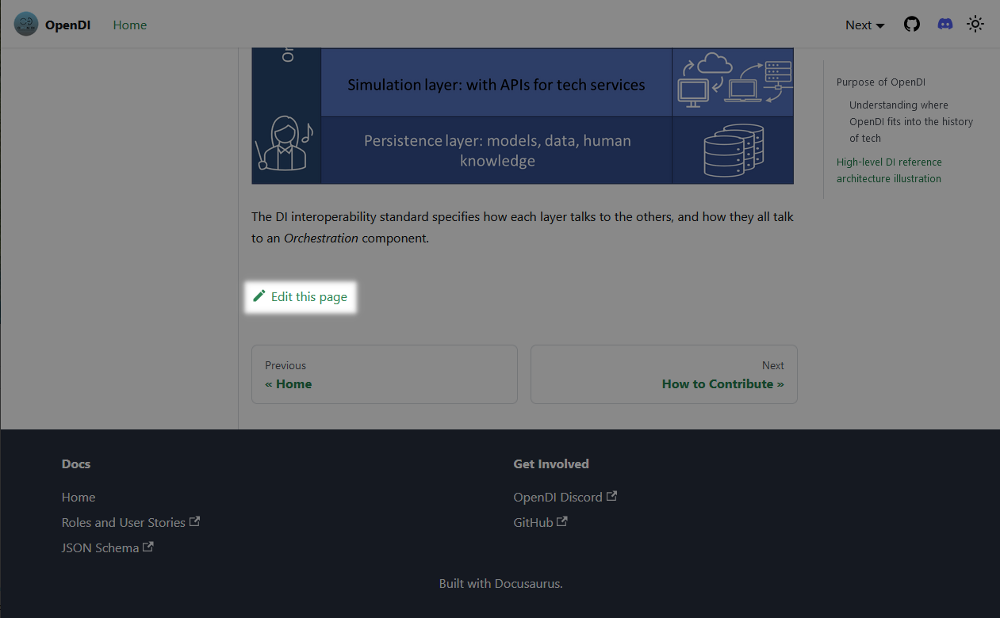

# Contributing to OpenDI Standards

We're glad you want to help out!  
OpenDI is a community initiative, so these standards are open to feedback and contributions.  Contributions and feedback follow typical GitHub processes.

## Project Structure

This project is divided into 3 main repositories, holding different content:

### Landing Site

Holds the source content for the main OpenDI landing pages, including introductory and cross-document resources like this contribution guide.

[Link to repo.](https://github.com/opendi/landing-site)

### Roles and User Stories

Holds source content describing Roles for a DI team, and the user stories for each role.

[Link to repo.](https://github.com/opendi/roles-user-stories)

### JSON Schema

Holds the OpenDI JSON Schema for Causal Decision Models, and source for the schema's documentation.

[Link to repo.](https://github.com/opendi/json-schema)

## Feedback

We use two main channels for feedback submission:

- GitHub Issues
- OpenDI Discord Server

Follow GitHub best practices for [submitting issues](https://docs.github.com/en/get-started/exploring-projects-on-github/finding-ways-to-contribute-to-open-source-on-github#opening-an-issue) and for [contributing via forks and pull requests](https://docs.github.com/en/get-started/exploring-projects-on-github/contributing-to-a-project). The sections below provide additional detail for these processes.

### GitHub Issues
GitHub Issues are best for providing actionable feedback about individual projects, including:

- bug reports
- requests for new features or additions
- suggestions for alterations or specific constructive criticism
- etc

To submit an issue,

1. Navigate to the **Issues** page of the relevant repository.  
    Links to each repository can be found above, but the easiest way to find the correct repository to use when providing feedback about a specific OpenDI webpage is to use the GitHub link in the top-right corner of each page.
2. Use the **issue search feature** to see if your issue/report/suggestion already exists.  
    If an issue already exists, feel free to add additional discussion in the comments section.
3. If no relevant issue exists, **submit a new issue**.
    1. Use a succinct title.
    2. Be descriptive and direct in your issue description.
    3. Assign a relevant issue tag.

  
**Use the GitHub link to easily access the GitHub repository associated with each page.**

### Discord
The OpenDI Discord Server is best for providing general feedback about projects, or the OpenDI initiative as a whole. You can also join in ongoing conversations with experts across many fields relevant to Decision Intelligence!

<iframe src="https://discord.com/widget?id=1208154608984129557&theme=dark" width="350" height="500" allowtransparency="true" frameborder="0" sandbox="allow-popups allow-popups-to-escape-sandbox allow-same-origin allow-scripts"></iframe>

## Direct Contribution

Direct contributions are welcome! Contributions should follow the standard [fork](https://docs.github.com/en/pull-requests/collaborating-with-pull-requests/working-with-forks/fork-a-repo) and [pull request](https://docs.github.com/en/pull-requests/collaborating-with-pull-requests/proposing-changes-to-your-work-with-pull-requests/creating-a-pull-request-from-a-fork) workflow. The working branch for most forks should be the `dev` branch.

To simplify this process, the website provides direct links to edit each page in the GitHub web client:
  
**Use the edit page link to access the GitHub web client and edit the source for the current page.**