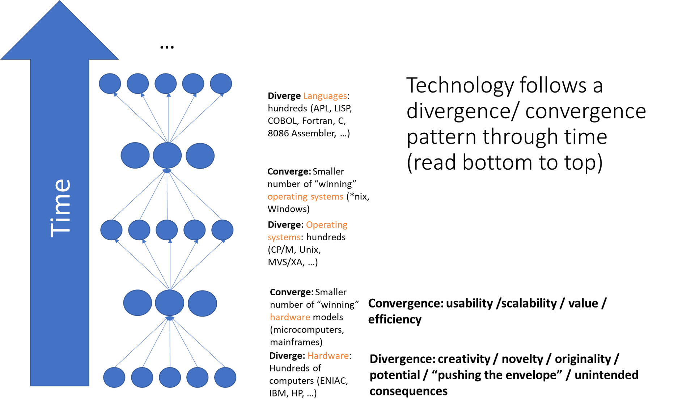

# OpenDI Intro

This page gives you a deeper dive into the purpose and history of OpenDI.

## Purpose of OpenDI

The purpose of the OpenDI initiative is to foster a vibrant and healthy ecosystem for decision intelligence (DI), which supports innovative DI research, a healthy vendor market, and &mdash; ultimately &mdash; better decisions in many domains worldwide.  

DI is a young discipline that many see as the future integration of AI.  Some see it as the equivalent of software engineering for analytics &mdash; a disipline that says "start with the end user's needs as primary, and then fit the data and tech you build within that framework".  Still others see DI as the culmination of (at least!) 2,000 years of increasing specialization in disciplines, without an answer to questions like, *"How can I combine my knowleddge of human psychology, data from my market, engineering knowledge from my experts, economic data from my financial analysts, plus whatever unexpected things are happening with the climate, globalization, and more, to navigate through a complex world?"*  You can learn about DI by googling "decision intelligence". A good reference is [The Decision Intelligence Handbook](https://www.dihandbook.com) (O'Reilly, 2023), or you might like [Decision Intelligence for Dummies](https://amzn.to/3zvhmzd).

One of the biggest impediments to the development of new disciplines like DI is _fragmentation_, where multiple entities are building DI systems unaware of each other, and in different ways.  The opposite of fragmentation is _standardization_, which has substantial benefits including reduced costs, reduced risks, faster time-to-market for vendors, easier use of research resources, and easier ways to create cross-organizational synergies.  Ultimately, all of these factors lead to substantially greater value to the people that use decision intelligence technology.

### Understanding where OpenDI fits into the history of tech
As technologies mature, they often go through a divergence/convergence pattern (Figure 1), where a creative "breathe out" period of "let a thousand flowers bloom" is followed by a "breathe in" convergence phase where cross-industry standards are established.  Examples of this pattern abound, from NTSC/PAL for televisions to DOCSIS in broadband networks, to standards that specify how a set-top-box talks to a television, to the TCP/IP and HTML standards that made the internet explode.

*Figure 1: Convergence/Divergence pattern of technology*

Importantly, these _open interoperability_ standards specify how technology from _different_ entities communicates with each other. Importantly, this is different than _open source_ standards, which unlike _interface_ standards, actually make public the _inside_ of the technology boxes. With _open interopability_ standards, vendors can still create proprietary (secret, and commercially valuable) systems; it is only the way that they interoperate with other systems that is open.

When good standards are built, technology markets *explode*: often creating huge benefits from the buyers of that technology. A good example is the standards underlying the internet. Those who used chat rooms, email, and connected computers in the days before internet standards were established can recall the massive friction of that landscape compared to what we see today.  When internet standards became widespread in the 1980s/early 1990s, it made a massive difference! So much so that it is now easy to forget that there was a time before the standards existed.

Why is this relevant? Because decision intelligence is at a crossroads where an explosion of vendors are increasingly fragmented, leaving the true value and democratization of this technology unrealized.

Please work with us as we create the standards that make DI "explode", too: not just for a handful of "big tech" firms but for thousands of academic departments, software vendors, consultants large and small, governments, and more, worldwide.

For a standards project to be successful, we have to start with a common language and a shared understanding of the "standard" components of a system.  For the telephone network, this said, "there is such a thing as a telephone, which is dialed in this particular way, which sends a signal down a wire in this way, and it is connected via some kind of wire to a central office (CO), and COs are connected together via long-distance lines".  Here, we do the same thing for decision intelligence, where we say, "here are the parts of a DI system, and different people can build different parts of it".

## High-level DI reference architecture illustration
Figure 2 shows the basic picture of how we see these "standard" components of a DI software system today (note that there are much more detailed versions of this picture that are in development at the moment, this is just a basic one to get you started):

*Figure 2: High-level DI reference architecture*

The DI interoperability standard specifies how each layer talks to the others, and how they all talk to an _Orchestration_ component.